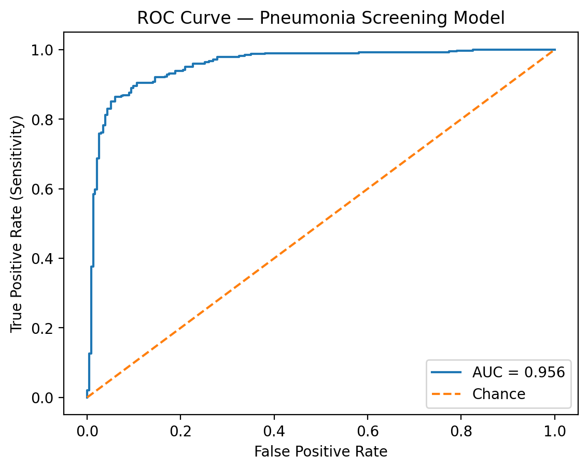
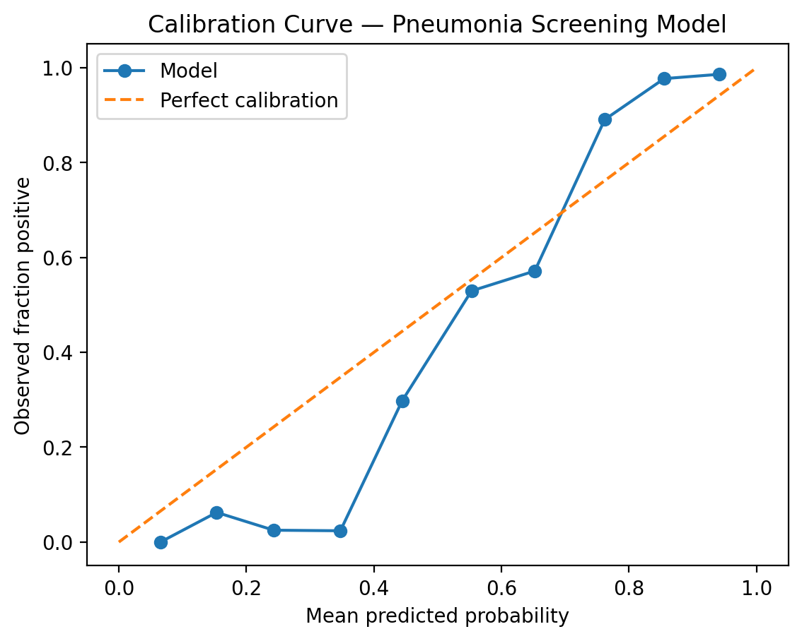

# Pneumonia Screening Using AI

## A Comprehensive Approach to Diagnosis and Treatment

This project leverages advanced AI techniques to enhance the screening process for pneumonia, aiming to improve patient outcomes and streamline clinical workflows. The tool is designed for healthcare professionals seeking to integrate AI-driven solutions into their practice.

## Calibration

Evaluation Plots

ROC Curve

Calibration Curve

---

## Confusion Matrix

Model performance across classification outcomes:

Interpretation:

- True Negatives (TN): Correct NORMAL predictions  
- True Positives (TP): Correct PNEUMONIA detections  
- False Negatives (FN): Missed pneumonia cases (clinical risk)  
- False Positives (FP): Overcalls requiring review  

Sensitivity-first calibration reduces FN at the cost of moderate FP — appropriate for screening deployment.

---

## Interpretability — Grad-CAM Visual Explanations

Grad-CAM highlights anatomical regions influencing model predictions, improving clinical transparency.

### Normal Case

Model attention is diffuse without focal consolidation signals.

---

### Pneumonia Case

Activation localizes to parenchymal opacification regions consistent with pneumonia patterns.